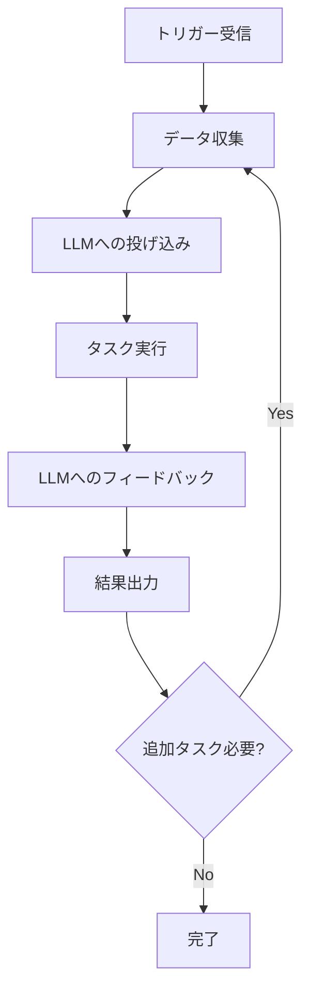

# 詳細_第3章 Platform 生成AI・AIエージェントが動く基盤とアーキテクチャ

#5層アーキテクチャ #LLM #RAG #シングルエージェント #マルチエージェント #RPA #技術基盤

## AIエージェントを支える5層アーキテクチャ

生成AIとAIエージェントを効果的に動作させるための技術基盤として、**5層から構成される包括的なアーキテクチャ**が重要です。

### レイヤー1：LLM（大規模言語モデル）レイヤー

**役割**：AIエージェントの推論エンジン

**主要機能**：
- 自然言語理解と生成
- 論理的推論と判断
- 文脈の理解と応答生成
- タスクの理解と実行計画立案

**技術要素**：
- GPT、Claude、Gemini等の基盤モデル
- ファインチューニングによる専門化
- プロンプトエンジニアリング
- モデルの選択と最適化

### レイヤー2：データ・ライブラリレイヤー

**役割**：AIエージェントが参照する情報源の管理

**構成要素**：

#### 外部データソース
- Web API連携
- 公開データベース
- リアルタイムデータフィード
- 外部サービス連携

#### 社内データベース
- 企業内の構造化データ
- 文書管理システム
- 業務システムのデータ
- ナレッジベース

#### データ処理機能
- データクレンジング
- 正規化・標準化
- インデックス作成
- メタデータ管理

### レイヤー3：アプリケーションレイヤー

**役割**：外部システムとの連携と機能統合

**主要機能**：
- 業務システムとのAPI連携
- ワークフロー管理
- バッチ処理・スケジューリング
- 外部サービス統合

**連携システム例**：
- CRM/SFA
- ERP
- メール・カレンダー
- チャットツール
- BI・分析ツール

### レイヤー4：UI・UXレイヤー

**役割**：ユーザーとのインタラクション

**インターフェース種類**：

#### チャット型UI
- 自然言語での対話
- リアルタイムな応答
- 文脈を保持した継続対話

#### ダッシュボード型UI
- 視覚的な情報表示
- データの可視化
- 操作パネル

#### API型UI
- システム間連携
- バックグラウンド処理
- 自動化されたワークフロー

### レイヤー5：AIエージェント統合レイヤー

**役割**：各レイヤーを統合し、自律的な動作を実現

**統合機能**：
- レイヤー間の調整
- タスクの分解と実行管理
- エラーハンドリング
- パフォーマンス監視

## 生成AIの3つの主要機能

### 1. 情報収集
**概要**：必要な情報を効率的に取得・整理

**具体的用途**：
- Web検索と要約
- 社内文書の検索
- データベースからの情報抽出
- 競合分析・市場調査

**技術的実装**：
```python
# 情報収集エージェントの例
class InformationGatheringAgent:
    def __init__(self):
        self.search_apis = []
        self.document_stores = []
    
    def gather_information(self, query):
        # 複数ソースからの情報収集
        web_results = self.search_web(query)
        internal_docs = self.search_internal(query)
        
        # 情報の統合と要約
        synthesized_info = self.synthesize(web_results, internal_docs)
        return synthesized_info
```

### 2. 情報生成
**概要**：新しいコンテンツや解決策の創出

**具体的用途**：
- 文書・レポート作成
- プレゼンテーション資料
- マーケティングコンテンツ
- プログラムコード生成

**技術的実装**：
```python
# コンテンツ生成エージェントの例
class ContentGenerationAgent:
    def __init__(self, llm_model):
        self.llm = llm_model
        self.templates = {}
    
    def generate_content(self, content_type, requirements):
        template = self.templates.get(content_type)
        prompt = self.build_prompt(template, requirements)
        
        content = self.llm.generate(prompt)
        return self.post_process(content)
```

### 3. 情報加工
**概要**：既存情報の変換・最適化・構造化

**具体的用途**：
- データ分析・可視化
- 文書の要約・翻訳
- フォーマット変換
- 品質向上・最適化

**技術的実装**：
```python
# 情報加工エージェントの例
class InformationProcessingAgent:
    def __init__(self):
        self.processors = {}
        self.validators = {}
    
    def process_information(self, data, processing_type):
        processor = self.processors[processing_type]
        processed_data = processor.transform(data)
        
        # 品質検証
        if self.validators[processing_type].validate(processed_data):
            return processed_data
        else:
            return self.error_correction(data, processing_type)
```

## AIエージェントの技術的フロー

### 標準的な実行フロー



### 各ステップの詳細

#### 1. トリガー受信
**種類**：
- ユーザーからの指示
- スケジュールされたタスク
- システムイベント
- 外部APIからの通知

#### 2. データ収集
**処理内容**：
- 関連データの特定
- 複数ソースからの情報取得
- データの前処理と検証

#### 3. LLMへの投げ込み
**プロセス**：
- プロンプト構築
- コンテキスト設定
- モデルへのクエリ実行

#### 4. タスク実行
**実行内容**：
- LLMの出力に基づく具体的なアクション
- 外部システムとの連携
- データの更新・保存

#### 5. LLMへのフィードバック
**フィードバック内容**：
- 実行結果の要約
- エラー情報
- 次のステップの提案

## RAG（Retrieval-Augmented Generation）検索精度向上対策

### RAGシステムの基本構成

```
質問入力 → 関連文書検索 → 文書取得 → LLMによる回答生成 → 回答出力
```

### 検索精度向上のための対策

#### 1. メタデータ付与
**目的**：文書の属性情報による検索精度向上

**実装例**：
```json
{
  "document_id": "doc_001",
  "title": "営業プロセス改善ガイド",
  "category": "営業",
  "department": "営業部",
  "created_date": "2024-01-15",
  "tags": ["プロセス改善", "効率化", "KPI"],
  "access_level": "internal"
}
```

#### 2. 分割チャンク化
**目的**：長文書の効果的な分割による検索性向上

**チャンク化戦略**：
- **意味的分割**：段落や章単位での分割
- **固定長分割**：一定の文字数での分割
- **重複分割**：オーバーラップを持たせた分割

```python
class ChunkingStrategy:
    def semantic_chunking(self, document):
        # 意味的な境界での分割
        chunks = []
        paragraphs = document.split('\n\n')
        
        current_chunk = ""
        for paragraph in paragraphs:
            if len(current_chunk + paragraph) < self.max_chunk_size:
                current_chunk += paragraph + "\n\n"
            else:
                if current_chunk:
                    chunks.append(current_chunk.strip())
                current_chunk = paragraph + "\n\n"
        
        if current_chunk:
            chunks.append(current_chunk.strip())
        
        return chunks
```

#### 3. リランキング（再順位付け）
**目的**：初期検索結果の精度向上

**手法**：
- **意味的類似度**による再評価
- **質問-回答の適合度**チェック
- **文書の信頼性**スコアリング

#### 4. ハイブリッド検索
**組み合わせ手法**：
- **キーワード検索** + **ベクトル検索**
- **構造化データ検索** + **非構造化データ検索**
- **リアルタイム検索** + **キャッシュ検索**

## シングルエージェント vs マルチエージェント

### シングルエージェントの特徴

**メリット**：
- 実装の**シンプルさ**
- **デバッグの容易性**
- **低い計算コスト**
- **一貫した動作**

**デメリット**：
- **単一障害点**のリスク
- **スケーラビリティ**の制限
- **専門性の限界**

**適用場面**：
- 単純なタスク処理
- プロトタイプ開発
- 小規模なアプリケーション

### マルチエージェントの特徴

**メリット**：
- **複雑なタスク**への対応
- **専門性の分散**
- **並列処理**による高速化
- **冗長性**による信頼性向上

**デメリット**：
- **複雑な設計**と実装
- **エージェント間の調整**コスト
- **デバッグの困難性**

**適用場面**：
- 複雑なビジネスプロセス
- 大規模なシステム
- 高度な専門性が必要な業務

### マルチエージェントアーキテクチャの設計

```python
class MultiAgentSystem:
    def __init__(self):
        self.agents = {}
        self.coordinator = AgentCoordinator()
        
    def add_agent(self, name, agent):
        self.agents[name] = agent
        
    def execute_task(self, task):
        # タスク分解
        subtasks = self.coordinator.decompose_task(task)
        
        # 並列実行
        results = []
        for subtask in subtasks:
            agent = self.coordinator.select_agent(subtask)
            result = agent.execute(subtask)
            results.append(result)
        
        # 結果統合
        final_result = self.coordinator.integrate_results(results)
        return final_result
```

## RPA（Robotic Process Automation）との差別化

### RPAの特徴と限界

**RPAの得意領域**：
- **ルールベース**の定型業務
- **画面操作**の自動化
- **データ入力・転記**
- **レポート生成**

**RPAの限界**：
- **柔軟性の欠如**
- **例外処理**の困難
- **学習能力**の不足
- **判断を伴う業務**への対応困難

### AIエージェントの進化ポイント

**AIエージェントの優位性**：

#### 1. 自律的な意思決定
```python
class AutonomousAgent:
    def make_decision(self, situation):
        # 状況分析
        analysis = self.analyze_situation(situation)
        
        # 選択肢の評価
        options = self.generate_options(analysis)
        best_option = self.evaluate_options(options)
        
        # 実行判断
        if self.confidence_score(best_option) > self.threshold:
            return best_option
        else:
            return self.request_human_input(situation)
```

#### 2. 推論と学習能力
- **過去の経験**からの学習
- **パターン認識**による改善
- **新しい状況**への適応

#### 3. 自然言語での対話
- **曖昧な指示**の理解
- **文脈の把握**
- **質問と確認**による精度向上

## 主要企業の自律型AIエージェント動向

### Google
**主要プロダクト**：
- **Bard Extensions**：Google Workspaceとの統合
- **Duet AI**：開発支援とコード生成
- **Search Generative Experience**：検索結果の生成AI強化

**特徴**：
- マルチモーダル対応
- 大規模な知識ベース活用
- リアルタイム情報との統合

### Microsoft
**主要プロダクト**：
- **Copilot for Microsoft 365**：オフィス業務の包括的支援
- **GitHub Copilot**：プログラミング支援
- **Azure AI Agent Service**：カスタムエージェント構築

**特徴**：
- 既存システムとの深い統合
- エンタープライズ向け機能
- セキュリティとガバナンス重視

### Salesforce
**主要プロダクト**：
- **Einstein GPT**：CRM業務の自動化
- **Slack GPT**：チーム連携の最適化
- **MuleSoft AI**：統合プラットフォーム

**特徴**：
- 顧客関係管理の専門性
- ノーコード/ローコード対応
- ビジネスプロセス最適化

### AWS
**主要プロダクト**：
- **Amazon Bedrock**：基盤モデルサービス
- **Amazon Q**：ビジネス用AIアシスタント
- **CodeWhisperer**：開発支援

**特徴**：
- クラウドインフラとの統合
- 企業向けセキュリティ
- スケーラブルなアーキテクチャ

## 具体的なAIエージェント構築ソリューション

### 会議議事録作成エージェントの実装

#### システム構成図
```
音声入力 → 音声認識API → 文字起こし → 
自然言語処理 → 要約生成 → フォーマット変換 → 
出力・共有
```

#### 実装例
```python
class MeetingMinutesAgent:
    def __init__(self):
        self.speech_recognizer = SpeechRecognizer()
        self.nlp_processor = NLPProcessor()
        self.summarizer = MeetingSummarizer()
        
    def process_meeting(self, audio_stream):
        # 音声の文字起こし
        transcript = self.speech_recognizer.transcribe(audio_stream)
        
        # 発言者識別と整理
        structured_transcript = self.nlp_processor.structure_dialogue(transcript)
        
        # 議事要約生成
        summary = self.summarizer.generate_summary(structured_transcript)
        
        # フォーマット整理
        formatted_minutes = self.format_minutes(summary)
        
        return formatted_minutes
    
    def format_minutes(self, summary):
        template = """
        # 会議議事録
        
        ## 日時・参加者
        {datetime_participants}
        
        ## 議題・決定事項
        {decisions}
        
        ## アクションアイテム
        {action_items}
        
        ## 次回までの課題
        {pending_issues}
        """
        return template.format(**summary)
```

### RAGエージェントの構築事例

#### アーキテクチャ概要
```
質問入力 → クエリ解析 → 関連文書検索 → 
文書ランキング → コンテキスト構築 → 
LLM推論 → 回答生成 → 出典明記
```

#### 実装フレームワーク
```python
class RAGAgent:
    def __init__(self, knowledge_base, llm_model):
        self.knowledge_base = knowledge_base
        self.llm = llm_model
        self.retriever = DocumentRetriever()
        
    def answer_question(self, question):
        # 関連文書の検索
        relevant_docs = self.retriever.search(
            question, 
            self.knowledge_base, 
            top_k=5
        )
        
        # コンテキスト構築
        context = self.build_context(relevant_docs)
        
        # プロンプト作成
        prompt = self.create_prompt(question, context)
        
        # LLMによる回答生成
        answer = self.llm.generate(prompt)
        
        # 出典情報の付与
        answer_with_sources = self.add_sources(answer, relevant_docs)
        
        return answer_with_sources
    
    def build_context(self, documents):
        context_parts = []
        for doc in documents:
            context_parts.append(f"出典: {doc.title}\n内容: {doc.content}")
        
        return "\n\n".join(context_parts)
```

---

**戻る**：[[章ごとのまとめ]]

**前章**：[[詳細_第2章 Operation 業務プロセスの再設計と実行]]

**次章**：[[詳細_第4章 People 組織的浸透と人材のスキル開発]]

**関連概念**：
- [[詳細_第2章 Operation 業務プロセスの再設計と実行]]（業務実装）
- [[詳細_第5章 Governance ルール・ガバナンスの策定]]（技術ガバナンス）
