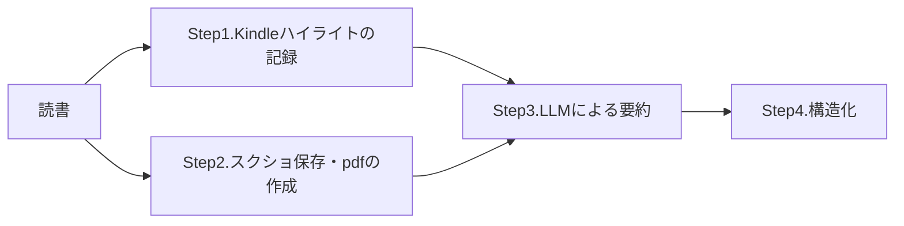

# Claude DesktopとObsidianで作る最強読書要約メモ
#LLM #Obsidian 


こんにちは、データアナリティクスグループの丸山です。
私は業務で必要な知識を得るために定期的に書籍を読むようにしているのですが、読書をする上で以下のようなあるあるを皆さんも体験したことがあると思います。

- 本は読んだけど、内容を思い出せない
- かといってメモを取るのは面倒だ
- 書籍で得られた知識同士がつながらず、断片的なままになってしまう

そんな悩みを、**Claude DesktopとObsidianの組み合わせ**で解決することを試みました。今回は、この革新的な読書要約システムを紹介します。なお、今回のシステムはKindleでの読書を行うことを前提にしています。

## Obsidianとは

Obsidianは、マークダウン形式でノートを作成・管理できる知識管理ツールです。最大の特徴は**ドキュメントのリンク機能**で、[[記法]]を使って関連するノート同士を自在に結び付けることができます。

従来のフォルダ階層型の情報管理とは異なり、Obsidianでは知識をネットワーク状に構築できるため、思わぬ発見や新しいアイデアの創発が期待できます。また、グラフビューによって知識のつながりを視覚的に確認することも可能で、「第二の脳」として機能するツールとして多くの研究者や知識労働者に愛用されています。

特に今回の読書要約システムでは、書籍間の関連性や、異なる章同士の概念的なつながりを表現するのに威力を発揮します。

## 今回作成した読書要約システムの概要
### 使用ツール

本システムでは以下のツールを組み合わせて使用します：

- **読書・データ収集**
	- **Kindle**
	- **Kindle Highlights**: 電子書籍のハイライトをObsidianに取り込むことができるプラグイン

- **要約処理**
	- **Claude Desktop**: ローカルPCに保存された書籍の情報を取得し、要約を作成するために使用
	- **Gemini(オプション)**: Claude Desktopで書籍情報を添付する際に、ファイルサイズが大きいと処理ができないケースがある。そのような場合はWebブラウザからGeminiを用いることで処理を代替可能

- **開発・自動化(オプション)**
	- **Claude Code / Cursor**: 書籍スクリーンショット取得の自動化に使用

この組み合わせにより、手動作業を最小限に抑えながら、高品質な読書要約を効率的に作成することができます。

### Obsidianのフォルダ構成

今回の読書要約システムは、以下の4つのフォルダに必要なファイルを保存することで実現されています。

```
obsidian_note/
├── 01_Templates/     # メモ作成のプロンプト・手順管理
├── 02_Bookhighlight/   # Kindleのハイライトを連携
├── 03_Bookall/       # 書籍のスクショ & pdfを格納
└── 04_Bookmemo/      # 構造化された最終メモを格納
```

###  ワークフロー
上述のツール・フォルダを用いて、以下のステップで要約を行います。ここからは、各ステップにおける処理の概要について説明します。



## Step1. Kindleハイライトの記録

Obsidianには豊富なコミュニティプラグインが用意されており、これらを活用することで様々な外部サービスとの連携が可能になります。今回のシステムでは特に「Kindle Highlights」プラグインを重要な構成要素として使用します。

### Kindle Highlightsプラグインの詳細

このプラグインは、Kindleアプリや端末で行ったハイライト（マーカー）をObsidianに自動同期する機能を提供します。具体的には以下のような機能があります：

**主要機能**
- **自動同期**: Kindleアカウントと連携してハイライトを取得
- **メタデータ管理**: 書籍情報（タイトル、著者、ASIN等）の自動記録
- **位置情報保持**: ハイライト箇所のKindle内位置情報を保持
- **フォーマット対応**: マークダウン形式での出力

**出力例**
```yaml
---
kindle-sync:
  bookId: '56288'
  title: Obsidianでつなげる情報管理術【完成版】
  author: Pouhon
  asin: B0CHY6MK42
  lastAnnotatedDate: '2025-07-05'
  bookImageUrl: 'https://m.media-amazon.com/images/I/711Mpk8f29L._SY160.jpg'
  highlightsCount: 11
---

## Highlights
言葉の形と記憶のカタチが全く違う。だから自分の考えを
文章や言葉にして、人にうまく伝えるのは難しいのです。
— location: [244] ^ref-34745
```

このプラグインを使用することで、読書中に気になった箇所や重要だと感じた部分を、後の要約作業で確実に反映させることができます。つまり、**読者の主観的な価値判断**をLLMによる要約に組み込むことが可能になります。

上記プラグインを用いて、02_Bookhighlightフォルダに自分がマーカーを引いた書籍の文章を自動的に保存し、後続のStep3で活用します。

## Step2. スクショ保存・pdfの作成

読書を行った後に、書籍のpdfを03_Bookallフォルダに保存します。これにより、LLMが書籍の全体像と文脈を理解できるようになります。

### PDFの入手方法

** PDF付属の場合**
Kindleの書籍では、購入時にPDFファイルが付属していることがあります。この場合は、そのファイルを直接03_Bookallフォルダに保存すれば作業完了です。

** スクリーンショットが必要な場合**
一般的なKindle書籍では、PDFが提供されていないため、書籍のスクリーンショットを取得してPDF化する作業が必要になります。この作業には以下の手順が含まれます：

1. **ページごとのスクリーンショット取得**: Kindleアプリで各ページを表示し、画像として保存
2. **ファイル名の統一**: 後の処理で扱いやすいよう、連番での命名
3. **PDF変換**: 複数の画像ファイルを1つのPDFにまとめる

### 自動化の可能性

上記作業の自動化はClaude CodeやCursorなどのAI支援開発ツールを用いて実現できます。例えば、以下のようなスクリプトを作成することで、手作業を大幅に削減できます：

- **自動スクリーンショット**: 指定した間隔でKindleページを自動キャプチャ
- **画像処理**: トリミング、解像度調整、ノイズ除去
- **PDF生成**: 複数画像の自動結合とOCR処理

詳細な実装方法については今回は触れませんが、技術的には十分実現可能です。

### 著作権に関する注意

スクリーンショットの取得は**あくまでも個人利用の範囲**に限られることに注意が必要です。作成したPDFファイルは以下の用途にのみ使用してください：

- 個人的な学習・研究目的
- 要約・メモ作成のためのLLM入力
- 知識管理システム内での参照

商用利用や第三者への配布は著作権法に抵触する可能性があるため、厳に慎む必要があります。

## Step3. LLMによる要約

Step1, 2で作成したファイル（Kindleハイライトと書籍PDF）をLLMに添付し、体系的な要約を生成します。重要なのは、Kindleハイライトのメモも同時に読み込ませることで、**読者が特に気になったポイントを加味した要約**を作成できる点です。
以下のようなプロンプトを使用します。
### 要約プロンプトのテンプレート（01_Templates/Bookmemo_prompt.md）

```markdown
添付したpdfの内容を、章ごとにmarkdown形式で要約してください。

併せて添付しているmarkdownはこの本を読んだ時のハイライトなので、
この情報も加味して要約すること。

章ごとの説明文は500文字程度にしてください。
```

なお、今回のシステムで使用する上記のようなプロンプトは、全て01_Templatesフォルダに保存して繰り返し使用できるようにしておきます。
上記のフォルダ運用と併せてClaude Desktopを使うことで、ローカル環境のみで処理が完結するメリットがあります。

### 出力結果の管理

プロンプトの実行結果は04_Bookmemoフォルダにドキュメント化して保存します。その際の保存ルールは以下の通りです：

- **フォルダ構造**: 書籍ごとに個別フォルダを作成
- **ファイル名**: 要約は「章ごとのまとめ.md」で統一
- **タグ**: 「書籍のジャンル」などの情報を加味したタグを作成し、ドキュメントに付与

この統一されたルールにより、後からの検索や参照が格段に効率化されます。
特に3つ目のタグはObsidian固有の機能であり、共通のタグを付与しておくと、異なる書籍の要約も横断的に検索することができます。

## Step4. 構造化

Step3で生成された要約を、より使いやすい形に構造化します。この段階では、以下のプロンプトテンプレートを使用し、Obsidianのリンク機能を最大限活用できる形式に変換します。

### 構造化プロンプトのテンプレート（01_Templates/Bookmemo_structure_prompt.md）

```markdown
指定した書籍の"章ごとのまとめ.md"を以下の手順で分割してください。
なお、当該のmarkdownファイルは`{Obsidianのドキュメントを作成したフォルダ}/04_Bookmemo/{書籍名}`というフォルダに存在します。

1. 各章の要約を2~3行程度にまとめる
2. そぎ落とされた文章があれば`詳細_{章の名前}.md`を作成
3. Obsidianでリンクが貼れるように編集する
```

### 階層設計の戦略的意義

この構造化プロセスには深い設計思想があります：

**概要レベル(2-3行要約)**
- 素早い復習と全体把握を行うのが目的
- 認知負荷を最小限に抑制し、短時間でのスキャンを可能に

**詳細レベル（完全版）**
- 深い理解と実践的応用を目的とする
- 具体的な問題解決、詳細な知識が必要な場合に参照

### 構造化プロンプトの実行環境
上述したプロンプトでは、`{Obsidianのドキュメントを作成したフォルダ}/04_Bookmemo/{書籍名}`というローカル環境のフォルダ名が指定されています。
以下の事前準備を行うことで、ローカル環境の情報を参照してプロンプトを実行することが可能になります
- Claude Desktopを使用端末にインストール
- その上で、Filesystem MCP Serverを呼び出せるように設定
Step1 ~ 3で使用するフォルダやファイルの命名規則を統一しているため、上記の事前準備ができていれば、先ほどのプロンプトを実行するだけで書籍要約のメモを構造化して保存することができます。

## 最終的な要約の形式

上記のStep1 ~ 4を経ることで、04_Bookmemoの中に以下のような体系的なまとめ資料を作成することができます。

```
04_Bookmemo/書籍名/
├── 章ごとのまとめ.md      # 全体概要（各章2-3行）
├── 詳細_第1章.md          # 深掘り内容
├── 詳細_第2章.md          # 深掘り内容
└── 詳細_第3章.md          # 深掘り内容
```

### Obsidianによる関係性の構築

Obsidianの真価は、この構造化されたコンテンツ間の関係性を動的に管理できる点にあります：

**階層的リンク**
「章ごとのまとめ.md」から各詳細ページへの`[[]]`リンクにより、全体から部分への自然なナビゲーションが実現されます。

**相互参照**
詳細ページ同士でも、関連する概念や相反する意見などを`[[]]`リンクで結ぶことで、多角的な理解が促進されます。

**テーマ別集約**
複数の書籍で共通するテーマ（例：「データサイエンス」「リーダーシップ」）をタグで管理し、横断的な知識マップを構築できます。

### 継続的な知識拡張

各章の内容についてより詳細にメモ・知識を残したい場合は、調べた内容を別ドキュメントに保存してさらにリンクを貼ることも可能です。例えば以下のような使い方が考えられます。

- **関連資料**: `参考_{トピック名}.md`
- **疑問・課題**: `疑問_{概念名}.md`

このように、読書要約を起点として知識ネットワークを有機的に拡張していくことで、単なる「読んだ記録」から「活用可能な知識資産」へと昇華させることができます。

## まとめ
今回ご紹介したClaude DesktopとObsidianを組み合わせた読書要約システムは、読書から得た知識を活用するために有用なシステムだと自分でも感じています。
生成AIを用いた知識習得の一つの方法として、皆さんの参考になれば幸いです。