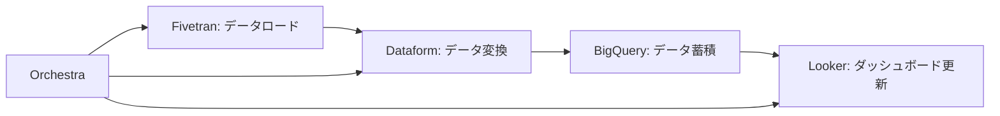

# Dataform AI支援詳細
#AI #Dataform #データ変換 #ELT #Google Cloud

## 概要

**Dataform**はGoogle Cloudのフルマネージドデータ変換（ELT）フレームワークで、2024年にGeminiモデルによる生成AI機能が導入され、SQLとJavaScript（SQLX言語）によるデータ変換パイプラインの開発効率が大幅に向上した。

## Dataformの基本機能

### コア技術

**SQLX言語**:
- SQLとJavaScriptの組み合わせ
- 依存関係の自動管理
- テストとドキュメント機能内蔵

**dbt類似の機能**:
- データ変換ロジックのコード管理
- バージョン管理とCI/CD統合
- データ品質テスト

### Google Cloud統合

**マネージド機能**:
- GUI管理インターフェース
- 自動スケジューリング
- インフラ管理不要

## 生成AI機能（2024年導入）

### Geminiによるコード補助

**機能概要**:
- 変換クエリの自動生成
- SQLXスクリプトの提案
- エラー修正とコード最適化

**利用方法**:
```javascript
// Dataformエディタ内で「Ask Gemini」を使用
// プロンプト例: "売上テーブルと予算テーブルを結合して前年比を計算する変換を書いて"
```

**自動生成例**:
```sql
config {
  type: "table",
  description: "売上と予算の前年比分析テーブル"
}

SELECT 
  s.period,
  s.product_category,
  s.actual_sales,
  b.budget_amount,
  LAG(s.actual_sales, 12) OVER (
    PARTITION BY s.product_category 
    ORDER BY s.period
  ) as previous_year_sales,
  ROUND(
    (s.actual_sales - LAG(s.actual_sales, 12) OVER (
      PARTITION BY s.product_category 
      ORDER BY s.period
    )) / LAG(s.actual_sales, 12) OVER (
      PARTITION BY s.product_category 
      ORDER BY s.period
    ) * 100, 2
  ) as yoy_growth_rate
FROM ${ref("sales_data")} s
LEFT JOIN ${ref("budget_data")} b
  ON s.period = b.period 
  AND s.product_category = b.product_category
```

### インタラクティブな開発支援

**機能**:
- 段階的なコード生成
- エラー解析と修正提案
- パフォーマンス最適化アドバイス

**例**:
```
ユーザー: "この集計が遅いので最適化したい"
Gemini: "以下の最適化を提案します：
1. パーティション分割の活用
2. 適切なインデックス設定
3. 集計順序の変更"
```

## Dataform Core v3.0

### 主要アップデート（2024年6月）

**設定ファイル移行**:
- `dataform.json` → `workflow_settings.yaml`
- より柔軟な設定管理
- 標準的なYAML形式採用

**機能強化**:
- プロジェクト管理の改善
- 設定の階層化対応
- 環境別設定の簡素化

### 設定例

**workflow_settings.yaml**:
```yaml
defaultProject: "your-project-id"
defaultLocation: "US"
defaultDatabase: "analytics"

environments:
  production:
    projectId: "prod-project"
    location: "US"
  staging:
    projectId: "staging-project"
    location: "US"

schedules:
  daily_refresh:
    cron: "0 6 * * *"
    timeZone: "America/New_York"
```

## Orchestra統合（2025年6月発表）

### ワークフローオーケストレーション

**Google Cloud Orchestra**との統合:
- Orchestra上からDataformジョブ実行をトリガー
- 統一されたワークフロー監視
- エラーハンドリングとリトライ機能

### 統合パイプライン例



**メリット**:
- 単一オーケストレーターでの制御
- 依存関係の可視化
- 統合監視とアラート

## 開発効率向上

### AI支援による効果

**コード生成時間短縮**:
- 従来: 複雑な変換ロジック作成に数時間
- AI活用後: プロンプト入力で数分

**品質向上**:
- ベストプラクティスの自動適用
- エラーの早期発見
- パフォーマンス最適化の提案

### 学習支援

**新人エンジニア向け**:
- SQLX記法の学習支援
- 実装パターンの提示
- エラー原因の説明

**経験者向け**:
- 高度な最適化技法の提案
- 新機能の活用方法
- アーキテクチャ改善案

## 活用事例

### 小売業データパイプライン

**要求**:
```
売上データ、在庫データ、顧客データを統合し、
日次で売上分析用のマートテーブルを作成したい
```

**AI生成コード**:
```sql
config {
  type: "incremental",
  unique_key: ["date", "store_id", "product_id"],
  description: "日次売上分析マート"
}

WITH sales_enriched AS (
  SELECT 
    s.transaction_date as date,
    s.store_id,
    s.product_id,
    s.quantity_sold,
    s.unit_price,
    s.total_amount,
    p.product_name,
    p.category,
    st.store_name,
    st.region,
    c.customer_id,
    c.customer_segment
  FROM ${ref("raw_sales")} s
  LEFT JOIN ${ref("products")} p ON s.product_id = p.product_id
  LEFT JOIN ${ref("stores")} st ON s.store_id = st.store_id
  LEFT JOIN ${ref("customers")} c ON s.customer_id = c.customer_id
  ${ when(incremental(),
      "WHERE s.transaction_date > (SELECT MAX(date) FROM " + this + ")"
    )
  }
)
SELECT * FROM sales_enriched
```

### 金融データ処理

**要求**:
```
取引データから疑わしい取引を検出する
機械学習用の特徴量テーブルを作成
```

**生成される特徴量**:
- 取引金額の統計量（平均、標準偏差）
- 取引頻度パターン
- 異常値スコア
- 時系列特徴量

## 比較: dbt vs Dataform

| 特徴 | dbt | Dataform |
|------|-----|----------|
| 実行環境 | セルフホスト/dbt Cloud | フルマネージド |
| 記法 | Jinja + SQL | SQLX (JS + SQL) |
| AI支援 | dbt Copilot | Gemini統合 |
| エコシステム | 豊富なプラグイン | Google Cloud統合 |
| コスト | オープンソース/商用 | 使用量ベース |

## 導入メリット

### 開発者向け

1. **学習コストの削減**: AI支援による直感的な開発
2. **コード品質向上**: 自動生成による一貫性
3. **生産性向上**: 反復作業の自動化

### 組織向け

1. **メンテナンス負荷軽減**: マネージドサービス
2. **スケーラビリティ**: Google Cloudインフラ活用
3. **統合性**: BigQuery/Lookerとのシームレス連携

## 制限事項・注意点

### 技術的制限

- BigQueryに特化（他DBサポート限定）
- JavaScript知識が必要な場面
- 複雑なロジックでのAI精度限界

### コスト管理

- 実行時間に基づく課金
- 大量データ処理時のコスト
- AI機能利用による追加料金

### 移行時の注意

- 既存dbtプロジェクトからの移行工数
- チーム内のスキル移行
- 運用プロセスの変更

## 今後の展望

### 機能拡張予定

- より高度なAI支援機能
- 他のデータソース対応拡大
- リアルタイム処理機能強化

### エコシステム統合

- Apache Airflowとの連携
- Kubernetesデプロイ対応
- オープンソースコミュニティとの連携

---

**関連リンク**
- [[分析向けAIツールまとめ]]
- [[BigQuery AI機能詳細]]
- [[dbt AI支援詳細]]

**Tags:** #Dataform #GoogleCloud #ELT #データ変換 #AI支援 #SQLX #Orchestra
